# App-Cinema-Course-Work-2022
Course Work 2022 

  
Об'єкт дослідження – система кінотеатру, яка повинна дозволити централізувати управління усіма процесами, пов'язаними з прийняттям і виконанням замовлення, дозволити керівникові своєчасно отримувати достовірну інформацію.  
Предмет дослідження - продаж білетів кінотеатра, мовою програмування C#, додаток Windows Forms.  
Мета роботи - процес автоматизації роботи кінотеатру, який полягає в розробці і впровадженні програмних продуктів для продажу і автоматизованого обліку продажі квитків з врахуванням різних видів місць,рядів, залів, а також пільгів (наприклад, для студентів та для школярів), системи підтримки постійних клієнтів, програм знижок і інших акцій. Процес автоматизації роботи кінотеатру також пов'язаний з оновленням не лише програмного забезпечення, що розоробляється, але і з оновленням, купівлею нового обладнання і витрат на його обслуговування. У цей список треба включити комп'ютер на кожне місце продавця-касира, устаткування серверної, квитковий принтер, грошовий ящики, також різні комутатори і комутацію.    
Завданнями роботи є:  
- вивчення позитивного ефекту від грамотного застосування автоматизованих систем управління в кінотеатрах;  
- вивчення в умовах економічної кризи інформаційних технологій, які можуть стати серйозним інструментом для оптимізації управління, скорочення витрат і дати безперечні конкурентні переваги на ринку;  
- розгляд роботи по плануванню закупівель і постачань і інші плюси;  
- автоматизація бізнес процесів;  
- автоматизація кінозалу.

    
Також необхідна зручна система для продажу квитків, бронювання квитків, перегляду які є фільми та на котру годину, відомості про фільми, жанри, виробників.    

  
Розділ 1. Дослідження об’єкта автоматизації     

Автоматизація об'єкта дослідження є об'єктивною необхідністю на етапі розвитку науку й техніки. Вона обумовлена:   
- збільшеними вимогами щодо прискорення процесу дослідження від початкового етапу постановки завдання до впровадження отриманих результатів у народне господарство;   
- вторгненням дослідника у дедалі складніші взаємозв'язки у природних (чи технічних) об'єктах дослідження, коли різко зростає кількість регульованих і контрольованих чинників, визначальних істотні сторони поведінки об'єкта, розширюються діапазони зміни вимірюваних величин, ускладнюється обробка результатів вимірів тощо;   
- необхідністю вивчення та оволодіння процесами, що протікають в умовах, що не піддаються безпосередньому сприйняттю.
  
  Особливу роль відіграє автоматизація об'єкта дослідження, коли йдеться про дослідження інженерної спрямованості, що безпосередньо пов'язані з завданнями розробки принципово нових технічних рішень або подальшого вдосконалення існуючих. Одна з проблем сучасних досліджень полягає в тому, що вони не повинні бути тривалими, оскільки в іншому випадку науково-технічні ідеї та техніко-економічні характеристики, закладені в створювані об'єкти, морально старіють ще до початку їхньої промислової експлуатації та широкого впровадження. Саме тому покращення якості та скорочення термінів дослідження, тобто підвищення їх ефективності, є необхідними для прискорення науково-технічного прогресу. Одним із головних засобів досягнення зазначеної мети якраз і є інформаційні системи досліджень (ІСІ)  
Прогнози та припущення про розвиток обєкта дослідження.   
Перш нід автоматизувати роботу кінотеатру, необхідно дослідити поточні процеси. Для цього, адміністраторам, що задіяні в автоматизації роботи кінотеатру, необхідно описати шлях документації і покрокове проходження процесів. На основі получених даних адміністратору потрібно створити таблицю, для того щоб виконувати поставлені задачі та визначати фільми, їх деталі, похідні таблиці та визначати інформацію про квитки.    
     
  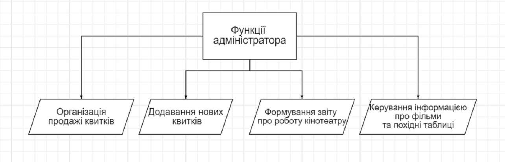

Рис. 1. Функції адміністратора    
Діаграми потоків даних (Data Flow Diagrams - DFD) є ієрархією функціональних процесів, пов'язаних потоками даних. Мета такого уявлення — продемонструвати, як кожен процес перетворює свої вхідні дані на вихідні, а також виявити відносини між цими процесами. Схема DFD 0-рівня:      

  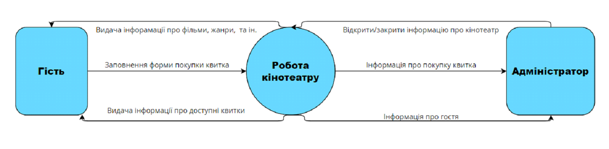
      
Схема DFD 1-го рівня:    
    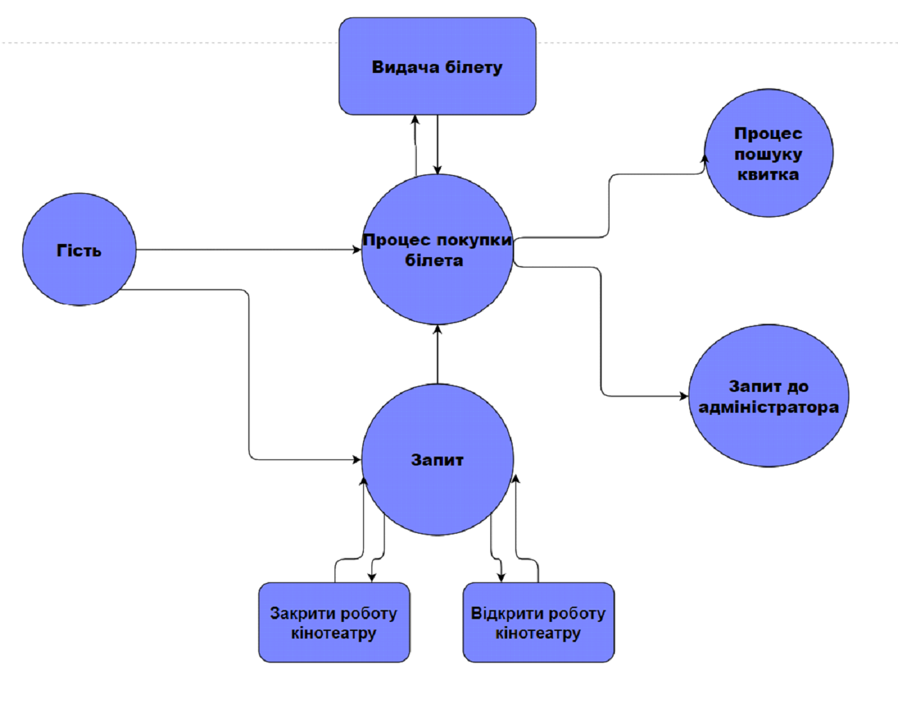 
    
    
Діаграма класів:  
    
  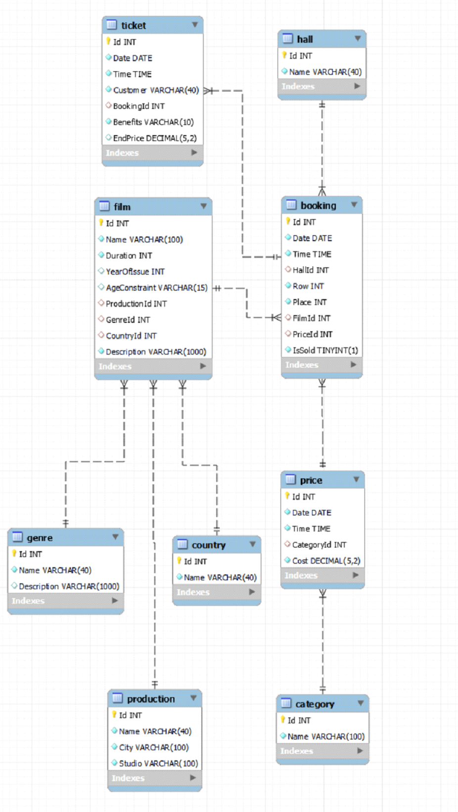
  
  ER діаграма відображає відносини набору сутностей, що зберігаються у базі даних та допомагає у поясненні логічної структури бази даних. Дана діаграма графічно представляє собою сутності предметної області (enteties), властивості (attributes) сутностей та зв’язки між ними (relationship). Сутність (entity) - клас реальних чи віртуальних однотипних об’єктів, інформацію про які необхідно зберігати у базі даних. Сутності з діаграми - країна, виробництво, категорія, ціна, жанр, зал, квиток, покупка, фільм. Також налаштовані зв’язки між сутностями на діаграмі. Зв’язки (relationship) - асоціація між сутностями. Приклад звязку “багатто-до-багатьох” з діаграми - один виробник може знімати багато фільмів / фільм має лише одного виробника. Також добавлені атрибути для опису кожної сутності та тип, який буде зберігатись у базі. Добавлені ключі для сутностей.   
Характеристика обєкту автоматизації.  
Кінотеатр - ця громадська будівля(чи частина його), обладнана для показу фільмів.  
Сучасний кінотеатр може багато що запропонувати глядачеві: цікавий фільм, якісне зображення і хороший звук, комфортні зали із зручними кріслами. Але починається кінотеатр із звичайної квиткової каси, в якій продаються квитки.  
Основним функціональним обов'язком касира кінотеатру є процес реалізації квиткових бланків глядачам.  
Робоче місце касира кінотеатру знаходиться на робочій станції касира, в якості якої застосовується IBM PC сумісний комп'ютер.  
Для організації робочого місця касира з технічного боку, вимагається:  
- IBM PC сумісний комп'ютер з операційною системою Windows;  
- монітор;  
- миша;  
- клавіатура;  
- спеціалізований принтер друку квитків(для прикладу DataMax - 3210 з ножем);  
- грошовий ящик;  
- квиткова стрічка(бланки строгої звітності), виготовлена в друкарні на термокартоне. При виготовленні стрічки враховуються побажання клієнта відносно дизайну(эксклюзивности стилю кінотеатру).   Виготовлена стрічка повинна відповідати технічним характеристикам, вказаним в документації на принтер(розміри, об'єм намотування в рулон, щільність картону, відбиваюча здатність чорної мітки и.т.д.). [13, с. 147]  
Додатково для організації робочого місця застосовують:  
- при оплаті за банківськими пластиковими картками використовується банківський прочитуючий пристрій, який прочитує інформацію і зв'язується з банком;  
- для зручності можна застосовувати додатковий монітор, повернений до покупця на якому відображається схема залу для глядачів того сеансу, про який йде мова між покупцем і касиром("Монітор покупця");  
- також для зручності, над касовим вузлом, розташовують або декілька плазмових панелей, або декілька моніторів, на які відображають репертуар поточного дня ("Інформаційні табло").  
  
  

Розділ 2. Обгрунтування вибору проектних рішень  
Для реалізації інформаційної системи автоматизації введення даних про співробітників підприємства ставилася задача розробити модель для побудови додатка, орієнтованого на роботу з базою даних (БД). Під таким додатком мається на увазі набір форм, кожна з яких звичайно відображає ті або інші дані з таблиць БД. Загальна модель була побудована на основі додатку Windows Forms. Для звязку з даними бази MySql було використано технологію ADO.NET.  
ADO.NET є технологією роботи з даними, яка заснована на платформі .NET Framework. Ця технологія представляє нам набір класів, через які ми можемо надсилати запити до баз даних, встановлювати підключення, отримувати відповідь від бази даних та здійснювати низку інших операцій.  
Основу інтерфейсу взаємодії з базами даних у ADO.NET представляє обмежене коло об'єктів: Connection, Command, DataReader, DataSet та DataAdapter. За допомогою об'єкта Connection відбувається встановлення підключення до джерела даних. Об'єкт Command дозволяє виконувати операції з даними БД. Об'єкт DataReader зчитує дані, отримані в результаті запиту. Об'єкт DataSet призначений для зберігання даних із БД та дозволяє працювати з ними незалежно від БД. І об'єкт DataAdapter є посередником між DataSet та джерелом даних. Головним чином через ці об'єкти і йтиме робота з базою даних.  
Однак, щоб використовувати один і той же набір об'єктів для різних джерел даних, необхідний відповідний провайдер даних. Власне через провайдер даних в ADO.NET здійснюється взаємодія з базою даних.   Причому для кожного джерела даних в ADO.NET може бути свій провайдер, який і визначає конкретну реалізацію вищевказаних класів.  
За замовчуванням у ADO.NET є такі вбудовані провайдери:  
⦁	Провайдер для MS SQL Server  
⦁	Провайдер для OLE DB (Надає доступ до деяких старих версій MS SQL Server, а також до БД Access, DB2, MySQL та Oracle)  
⦁	Провайдер для ODBC (Провайдер для джерел даних, для яких немає своїх провайдерів)  
⦁	Провайдер Oracle  
⦁	Провайдер компанії EntityClient. Провайдер даних для технології ORM Entity Framework  
⦁	Провайдер для сервера SQL Server Compact 4.0  
Крім цих провайдерів, які є вбудованими, існує також безліч інших, призначених для різних баз даних, наприклад, як у нашому випадку - MySQL.  
Основні місця імен, які використовуються в ADO.NET:  
⦁	System.Data: визначає класи, інтерфейси, делегати, що реалізують архітектуру ADO.NET  
⦁	System.Data.Common: містить загальні класи для всіх провайдерів ADO.NET  
⦁	System.Data.Design: визначає класи, які використовуються для створення власних наборів даних  
⦁	System.Data.Odbc: визначає функціональність провайдера даних для ODBC  
⦁	System.Data.OleDb: визначає функціональність провайдера даних для OLE DB  
⦁	System.Data.Sql: зберігає класи, які підтримують специфічну для SQL Server функціональність  
⦁	System.Data.OracleClient: визначає функціональність провайдера для баз даних Oracle  
⦁	System.Data.SqlClient: визначає функціональність провайдера для баз даних MS SQL Server  
⦁	System.Data.SqlServerCe: визначає функціональність провайдера для SQL Server Compact 4.0  
  
Розглянемо деталі структури проекту Windows Forms:  
Dependencies - це вузол містить складання dll, які додані в проект за замовчуванням. Ці збірки містять класи бібліотеки .NET, які використовуватиме C#.  
Розглянемо деталі форм на прикладі головного класу форми - FormMain, що представляє графічну форму - фактично те вікно, яке побачимо на екрані під час запуску проекту.  
Цей клас визначається як частковий (з модифікатором partial) та успадковується від вбудованого класу Form, який містить базову функціональність форм.  
У самому класі FormMain визначено за замовчуванням лише конструктор, де викликається метод InitializeComponent(), який виконує ініціалізацію компонентів форми із файлу дизайнера.  
Поруч із цим елементом можна побачити інший файл форми - FormMain.Designer.cs. Це файл дизайнера - він містить визначення компонентів форми, доданих на форму у графічному дизайнері, і саме його код по суті передається вище через виклик InitializeComponent()  
Program.cs визначає точку входу до програми. Цей файл містить клас Program. Виконання програми мовою C# починається з методу Main. І в класі Program якраз визначено такий метод.  
Метод Main має атрибут [STAThread]. Цей атрибут необхідний коректної роботи компонентів Windows. У самому методі спочатку викликається метод ApplicationConfiguration.Initialize(), який встановлює деяку базову конфігурацію програми  
Потім викликається метод Application.Run(new FormMain()), в який передається об'єкт, що відображається за замовчуванням на екрані форми.  
Тобто, коли ми запустимо програму, спрацює метод Main, у якому буде викликаний метод Application.Run(new FormMain()), завдяки чому ми побачимо форму FormMain на екрані.  
Також є файл проекту csproj. Файл CSPROJ - це проект програмного продукту мовою C#, створений серед розробки програм Microsoft Visual Studio. Файл зберігає налаштування проекту та посилання на всі ресурси, що використовуються у проекті. Проект може бути скомпільований у програму за допомогою платформи збірки MSBuild від Microsoft.  
Для компіляції програми Windows Forms наведено такі настройки:  
⦁	OutputType: визначає вихідний тип проекту. Повинен мати значення WinExe - тобто додаток, що виконується з розширенням exe під Windows  
⦁	TargetFramework: визначає версію фреймворку .NET, що застосовується для компіляції. Оскільки при створенні проекту було обрано версію .NET 6, а сам проект залежить від компонентів Windows, то тут має бути значення net6.0-windows  
⦁	Nullable: підключає до проекту функціональність посилальних nullable-типів  
⦁	UseWindowsForms: вказує, чи проект буде використовувати Windows Forms (для цього встановлюється значення true)  
⦁	ImplicitUsings: включає в проект функціональність глобальних просторів імен, що неявно підключаються.  
Розділ 3. Побудова проекту КІС  
3.1 Формування вимог користувача до АС  
Автоматизація процесів обліку і продажу квитків повинна включати розробку системи, що забезпечує зберігання і обробку даних про досконалі замовлення. Декілька залів різних видів, постійний потік відвідувачів і великий вибір фільмів зобов'язують автоматизувати облік проданих і вільних місць.  
Однією з вимог до програмної системи, що розробляється, є зберігання таблиці з початковими даними у файлі. Усі зміни, що вносяться у базу даних, не повинні втрачатися при завершенні роботи з програмою.  
Інформація повинна включати:  
- відомості про фільм (назва, жанр, опис, країна виробник, рік виходу, тривалість, вікові обмеження);   
- відомості про виробника;  
- відомості про жанри;  
- відомості зали;  
- відомості про категорії;  
- відомості про країни;  
- ціна квитка залежно від часу показу(враховуються пільги наприклад для школярів і студентів) і місця в залі(партер, балкон бельетаж, ложа, VIP місця);  
- відомості про кіносеанс (тривалість, час і дата показу фільму тип кінозалу (великий зал, VIP зал і т. п.));  
- відомості про куплені білети користувача  
- номер місця і ряд в кінозалі(враховуються продані і вільні місця).  
Користувач системи повинен мати можливість виконувати наступні запити:  
- отримати список доступних білетів по назві фільму, по датах, по часу показу фільму, також по назві залу;  
- купити білет(-и), що будуть доступні за попередніми параметрами пошуку, також мати можливість вказати пільги при покупці білету  
- видати список фільмів, які будуть показані в заданий день тижня, у вибраний інтервал часу в усіх кінозалах;  
- отримати список і загальну кількість фільмів по назві, жанру, виробницту і т. д.;  
- видати список тематичних кіносеансів, що проходять в певних кінозалах, за вказаний період часу;  
- сформувати список цін квитків для певного фільму залежно від часу показу, його тривалості, типу кінозалу, місця в залі;  
АС для кінотеатру повинна складатися з трьох головних модулів.  
Модуль адміністрування, призначений для визначення геометрії глядацьких місць, створення і редагування геометричних і цінових схемам, налаштування звітів, налаштуванню форм бланків квитків, управління правами користувачів системи і загальними налаштуваннями і конфігурацією системи.   
Модуль продажу і бронювання квитків повинен швидко і легко обслуговувати покупців з можливістю застосування різноманітних знижок і обслуговуванням клубних карт. Необхідно, щоб за результатами роботи автоматично готувалися усі необхідні звіти для бухгалтерії і керівництва. Простий інтерфейс системи повинен дозволяти в найкоротші терміни проводити навчання касирів.  
Модуль підготовки звітності і взаєморозрахунків з прокатниками повинен дозволяти повністю автоматизувати підготовку будь-яких звітів для відділу маркетингу і керівництва. Необхідно, щоб облік за договорами з прокатниками в розрізі кожної фільмокопії дозволяв автоматично створювати і експортувати бухгалтерські проводки.  
Для проектування інформаційної системи використовується система управління реляційними базами даних - MySql, технологія .NET - Windows Forms Application (C#) для створення зручного призначеного для користувача інтерфейсу та технологія ADO.NET для звязку з базою даних.  
  
3.2 Архітектура системи  
   
В архітектуру системи Booking Tickets бронювання квитків входять такі складові:   
— застосунок Windows Forms, що встановлений на комп’ютері - графічний інтерфейс користувача, та зможе використовуватись лише на операційних системах Windows.   
Доступ до застосунку мають усі користувачі, в тому числі адміністратор.   
Доступ до бази даних має тільки адміністратор.   
Додаток, встановлений на комп’ютері, може передати користувачеві такі дані:   
— інформацію про фільм;   
— інформацію про куплені квитки;   
— інформацію про розклад;   
— інформацію про ціни;   
— інформацію про вільні й заброньовані місця;   
У базі даних зберігається всі інформація, яка надається користувачеві додатка. Також через базу даних вносяться зміни про деталі фільму, виробників, жанри, країни, ціни квитків тощо. Адміністратор може змінювати дані будь-якої таблиці, також додати нові дані до таблиць та видалити за необхідності.  
Загальну схему потоків інформації системи бронювання Booking Tickets подано на рисунку 1.1.   
Програма, встановлена на комп’ютері, весь час підключена до бази даних та обмінюється з нею інформацією. Вона передає користувачеві актуальні дані й повертає базі даних зміни, які вніс користувач, а також зміни, що вносить адміністратор.        
    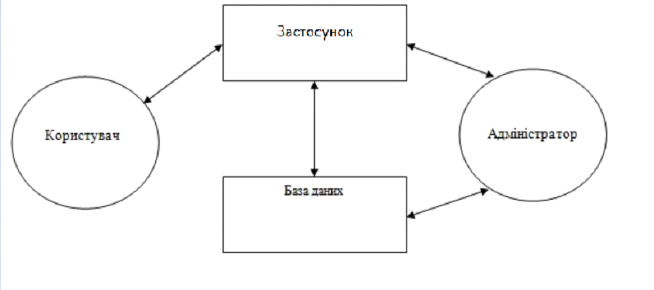
  Рисунок 1.1 — Схема потоків інформації у системі   

         
Для адміністратора існує окрема форма — де ввіши логін та пароль, адміністратору відкривається нова форма з управлінням всією базою даних, де він може внести зміни в будь-яку частину (фільм, ціни, жанр тощо). Програма передасть ці дані базі даних та одразу внесе зміни і збереже їх у базі, також зміни одразу будуть відображатись на самих формах (у додатку для кожної форми виконане динамічне оновлення даних).   

Розділ 4. Опис системних процесів у КІС мовою програмування  
4.1 Класи і методи програми  
У розробленій програмній системі бронювання квитків Booking Tickets є ряд класів.   
Головний клас Program є звичайним класом мови програмування C#, на початку якого йдуть підключення просторів імен. За замовчуванням він містить тільки один метод Main, який є точкою входу в програму та запускає головну форму FormMain.      
Клас FormMain є головною формою програми, що запускається одразу при виконанні головного методу, містить методи для обробки кнопок (наприклад, buttonAdministration_Click та ін.), а також і самі елементи (наприклад, кнопка buttonAdministration та ін.) які відповідають за різні функції для користувача та адміністратора.  
Методи та елементи класу FormMain показано на рисунку 1.2.   
    
Рисунок 1.1 — Методи класу FormMain  
Клас FormAdmin — це клас, що відповідає за аутентифікацію адміністратора, тобто це форма входу для адміністратора, вона створена в цілях безпеки, щоб будь-який користувач не отримав доступ до бази даних. Тут є такі методи, як buttonClose_Click, buttonEntry_Click та конструктор класу. Ці методи відповідають за перевірку введених даних (логін та пароль) на ті, що встановлені у додатку. Для того, щоб захистити логін і пароль, та  щоб його не зміг отримати будь-який користувач, вірний логін і пароль були внесені до файлів ресурсів проекту (resources-файл або resx). Ресурси представляють собою  певні невиконані дані, які логічно розгортаються разом з додатком. На рисунку 1.2 наведені рядкові дані resx файлу:  
   
Рисунок 1.2 - Файл ресурсів resources.rex  
Методи та елементи класу FormAdmin подано на рисунку 1.3.   
 Клас FormAdministration — це головна форма для адміністратора, що буде містити доступ до бази даних, та буде відкриватись після авторизації. Дана форма буде розгортати панель вкладок tabControl, на якій будуть розміщені всі таблиці (в datagridview елементах) баз даних з відповідними їм кнопками для виконання усіх CRUD операцій.    
  
    
Рисунок 1.3 — Методи та елементи класу FormAdmin  
Клас FormCategory — клас, в якому є можливість ввести адміністратору дані про категорії (назва) та добавити її до бази даних, або змінити запис про вже існуючу категорію у базі. Вигляд класу FormCategory подано на рисунку 1.4.  
  
    
Рисунок 1.4 - Методи та елементи класу FormCategory  
Клас FormCountry — клас, в якому є можливість ввести адміністратору дані про країну та добавити її до бази даних, або змінити запис про вже існуючу країну у базі. Вигляд класу FormCountry подано на рисунку 1.5.   
   
Рисунок 1.5 - Методи та елементи класу FormCountry   
Клас FormGenre — клас, в якому є можливість ввести адміністратору дані про жанр фільму (назва) та добавити його до бази даних, або змінити запис про вже існуючий жанр фільму у базі.  Також є конструктор та метод, що буде виконуватись після закриття форми. Вигляд класу FormGenre подано на рисунку 1.6.   
   
Рисунок 1.6 - Методи та елементи класу FormGenre   
Клас FormProduction — клас, в якому є можливість ввести адміністратору дані про виробника (назву, місто та студія) та добавити його до бази даних, або змінити запис про вже існуючого виробника у базі. Також є конструктор та метод, що буде виконуватись після закриття форми. Вигляд класу FormProduction подано на рисунку 1.7.   
   
Рисунок 1.7 - Методи та елементи класу FormProduction   
Клас FormHall — клас, в якому є можливість ввести адміністратору дані про зали у кінотеатрі та добавити його до бази даних, або змінити запис про вже існуючий зал у базі. Також є конструктор та метод, що буде виконуватись після закриття форми. Вигляд класу FormHall подано на рисунку 1.8.   
   
Рисунок 1.7 - Методи та елементи класу FormHall   
Клас FormFilm — клас, в якому є можливість ввести адміністратору дані про фільм (назва, тривалість, рік випуску, вікові обмеження, виробник, жанр, опис) та добавити його до бази даних, або змінити запис про вже існуючий фільм у базі. Крім того, дані про жанр та виробника будуть підтягуватись автоматично із вже існуючих у базі даних. Також є конструктор, метод, що буде виконуватись після закриття форми та метод, що буде виконуватись при відкритті форми. Вигляд класу FormFilm подано на рисунку 1.8 та 1.9.   
   
Рисунок 1.8 - Методи та елементи класу FormFilm   
   
Рисунок 1.9 - Продовження елементів класу FormFilm   
Клас FormPrice — клас, в якому є можливість ввести адміністратору дані про ціни квитків в залежності від фільму, дати, часу, залу, місця та категорії, а також  добавити записи до бази даних, або змінити запис про вже існуючий запис у базі. При цьому категорії будуть підтягуватись автоматично із бази даних, а дата та час визначені за допомого спеціальних елементів для роботи з датою та часом. Також визначено метод конструктор та метод, що буде виконуватись при відкритті форми. Вигляд класу FormPrice подано на рисунку 1.10.   
   
Рисунок 1.10 - Методи та елементи класу FormPrice   
До вище наведених форм доступ має лише адміністратор, коли пройде аутентифікацію. Зараз наведемо форми, що будуть доступними для будь-якого користувача, що буде використовувати застосунок.
Клас FormFilmByData - клас, що дозволяє подивитись на список фільмів в залежності від його даних, таких як жанр, виробництво та назва фільму, а також  загальну кількість фільмів. У даному класі використовується технологія dynamic-sql. Динамічний SQL – це методологія програмування для генерації та виконання операторів під час виконання. Він в основному використовується для написання універсальних та гнучких програм, в яких оператори SQL будуть створюватися та виконуватись під час виконання відповідно до вимог. Клас містить метод formSql, який формує sql-запит до бази даних, при цьому параметрами даного методу будуть назва фільму, виробництво та жанр, які і будуть визначатись динамічно в процесі виконання програми. У класі також є метод UpdateData, який буде оновлювати елемент datagridview з даними. Також є методи, що будуть виконуватись при зміні тексту чи індексу вибраного рядка елементів comboBox (comboBoxFilm - елемент для реалізації випадаючого списку фільмів та comboBoxGenre - елемент для реалізації випадаючого списку жанрів)    Методи та елементи класу FormFilmByData наведено на рисунках 1.11 та 1.12.  
  
   
Рисунок 1.11 - Методи та елементи класу FormFilmByData  
   
Рисунок 1.12 - Продовження методів та елементів класу FormFilmByData  
Клас FormFilmByWeekday - клас, що дозволяє подивитись на список фільмів в залежності від дня тижня та дати і часу. У даному класі використовується звернення до процедури, що реалізавана у базі даних MySql - sp_BookingInfoByWeekdayTime.  Методи та елементи класу FormFilmByWeekday наведено на рисунку 1.13.  
   
Рисунок 1.13 - Методи та елементи класу FormFilmByWeekday   
Клас FormFilmPriceByDate - клас, що дозволяє подивитись на ціни фільмів в залежності від дати і часу та зали. У даному класі використовується звернення до процедури, що реалізавана у базі даних MySql - sp_PricesByRequirements.  Методи та елементи класу FormFilmPriceByDate наведено на рисунку 1.14.  
   
Рисунок 1.14 - Методи та елементи класу FormFilmPriceByDate   
Клас FormTickets - клас, що дозволяє подивитись на доступні квитки у кінотеатрі, також позволяє здійснювати пошук по назві фільму, даті, часу та по залі. Крім того, у даній формі користувач буде мати змогу купити обраний(-і) квиток(-и). А також, якщо користувачеві потрібні пільги, то для нього буде зменшена ціна. У даному класі використовується звернення до процедур, що були реалізавані у базі даних MySql - sp_BookingInfo (процедура відповідає за виведення інформації про квитки), sp_BookingInfoByName (процедура відповідає за виведення інформації про квитки по назві фільму), sp_BookingInfoByNameDate (процедура відповідає за виведення інформації про квитки по назві фільму та даті), sp_BookingInfoByNameTime (процедура відповідає за виведення інформації про квитки по назві фільму та часу), sp_BookingInfoByNameHall (процедура відповідає за виведення інформації про квитки по назві фільму та залі) , sp_BookingInfoByNameDateTime (процедура відповідає за виведення інформації про квитки по назві фільму, даті та часу), sp_BookingInfoByNameDateTimeHall (процедура відповідає за виведення інформації про квитки по назві фільму, даті, часу та залі), sp_BookingInfoByNameDateHall (процедура відповідає за виведення інформації про квитки по назві фільму, даті та залі), sp_BookingInfoByNameTimeHall (процедура відповідає за виведення інформації про квитки по назві фільму, часу та залу). На відміну від класу FormFilmByData, де використовувався динамічний SQL, у даному класі FormTickets відбувається звернення до процедур на всі розглянуті випадки у методі CallProcedure, який перший параметром приймає mysql зєднання, другим параметром елемент datagridview, третім - рядок з назвою процедури, та словник dictionary<string, string> з параметрами процедури.  Методи та елементи класу FormTickets наведено на рисунках 1.15 та 1.16.  
   
Рисунок 1.15 - Методи та елементи класу FormTickets  
  
  
   
Рисунок 1.16 - Продовження методів та елементи класу FormTickets  
Клас FormMyTickets - клас, що дозволяє подивитись на інформацію про куплений користувачем квиток. Для виведення даних про квиток, необхідно вказати прізвище, яке вводилось при покупці, а також номер білета, що користувач купив у формі FormTickets. У даному класі також використано звертання до процедури sp_TicketByIdCustomer, що була реалізована у базі даних MySql, яка і виконує пошук білета. Якщо користувач ввів вірні дані, то у формі буде виведена інформація про білет, а якщо ні - то рядок про те, що певні дані не є вірними.  Методи та елементи класу FormMyTickets наведено на рисунку 1.17.
   
Рисунок 1.15 - Методи та елементи класу FormMyTickets  
Таким чином, розроблені класи моделей дають можливість реалізувати роботу Windows Forms додатку Booking Tickets щодо надання користувачеві різноманітної інформації.   
   
  
  

4.2 Робота з базою даних  
Вся інформація додатку Booking Tickets зберігається у базі даних MySql. Для адміністратора (менеджера) додаються права на створення нових даних та редагування існуючих даних, які містяться в базі, а також видалення необхідних даних. Дані дії адміністратор може виконати, як і з додатку Windows Forms, так і з самої бази даних MySql, для прикладу за допомогою інструменту для візуального проектування баз даних MySql Workbench.   
Вигляд структури бази даних подано на рисунку 1.16.   
    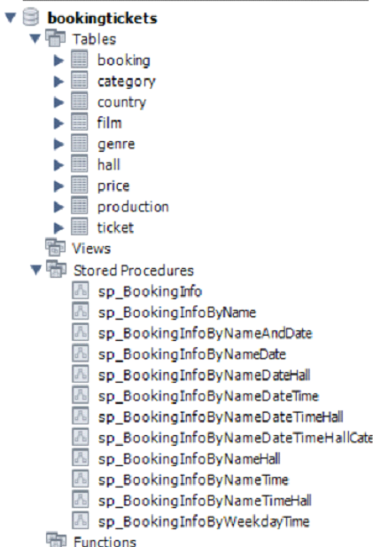
Рисунок 1.16 — Вигляд структури бази даних у MySql Workbench  
 Для прикладу, розглянемо таблицю Film - що відповідає за дані про фільм. На рисунку 1.17 подано структуру таблиці Фільм - її стовпці та ключі.  
    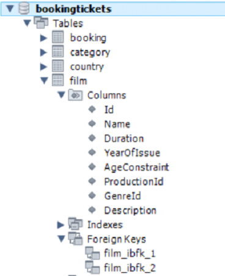  
Рисунок 1.16 — Структура таблиці Film  
  

    
Тут адміністратор може заповнити чи змінити основні дані про фільм такі, як:   
— поле name — назва фільму;   
— поле duration — тривалість фільму (у хвилинах);   
— поле id — ідентифікатор фільму. Дані у стовпець з ідентифікатором будуть заповнбватись автоматично;   
— поле yearofissue— рік випуску фільму;   
— поле ageconstraint — вікові обмедення для фільму;   
— поля productionid — ідентифікатор виробництва. Це зовнішній ключ на таблицю Production стовпець Id;   
— поле genreid—ідентифікатор жанру фільму. Це зовнішній ключ на таблицю Genre стовпець Id;   
— поле description — опис фільму.   
Дані про бронювання чи купівлю квитка надходять у таблицю Booking.    
У таблиці Booking адміністратор може побачити, який квиток куплений, а який ні. При покупці користувачем квитка, дані не будуть видалені із таблиці, натомість у стовпець IsSold буде записуватись значення true, якщо квиток був куплений, а false - якщо ні. Також важливо, що цей стовпець враховується при покупці користувачем квитка. Якщо квиток куплений. То користувач у таблиці з вільними квитками його не побачить. Також тут міститься інформація про номер ряду, місця, зали, категорії і вартість квитка.   
Для зручності виведення даних у додатку, було створено процедури. Збережені процедури є набором команд SQL, які можуть компілюватися і зберігатися на сервері. Таким чином, замість того, щоб зберігати часто використовуваний запит, додаток може посилатися на відповідну процедуру, що зберігається. Це забезпечує кращу продуктивність, оскільки цей запит має аналізуватися лише один раз і зменшується трафік між сервером та клієнтом. Концептуальний рівень можна підвищити за рахунок створення на сервері бібліотеки функцій.   
  
  
  
  
  
  
  
  
  
  
  
4.3 Побудова реляційної моделі даних  
Використовуючи ER-діаграму з попереднього пункту та обмеження, встановлені для даної предметної області, побудуємо реляційні відносини для БД покупки білетів.   
Перша нормальна форма. Вимоги для першої нормальної форми (1NF) полягає в тому, щоб таблиці відповідали реляційній моделі даних і дотримувались певних реляційних принципів:  
1)	В таблиці не повинно бути рядків, що повторяються  
2)	В кожній комірці повинні бути атомарні дані   
3)	В таблиці повинні бути дані одного типу  
4)	Відсутні масиви і списки в будь-якому виді    
Після того, як таблиці бази даних були приведені до першої нормальної форми, можна виконувати приведення бази до другої нормальної форми.  
Друга нормальна форма. Вимоги для другої нормальної форми (2NF):  
1)	Таблиця повинна бути в першій нормальній формі  
2)	Таблиця повинна мати ключ, по якому можна унікально ідентифікувати кожний рядок таблиці  
3)	Всі неключові стовпці повинні бути залежні від ключа (в випадку, якщо ключ складений, то залежні від повного ключа)  
Ключ - це стовпець або набір стовпців, по яким можна унікально ідентифікувати кожний рядок таблиці. По ключу можна звернутись до певного рядка в таблиці.  
Після того, як таблиці бази даних були приведені до другої нормальної форми, можна виконувати приведення бази до третьої нормальної форми.    
Третя нормальна форма. Вимоги до третьої нормальної форми:    
1)	Таблиця повинна бути в другій нормальній формі  
2)	В таблиці повинна бути відсутня транзитивна залежність  
Транзитивна залежність це коли неключові стовпці залежать від значень інших неключових стовпців. Тобто, потрібно виносити всі не ключові поля, вміст яких може відноситись до декількох записів таблиці в окремі таблиці.  
У таблиці “Фільм” жанр, виробництво та країна не залежать від первинних ключів, тому відомості про ці параметри виносяться в окремі таблиці. У такому випадку, назви жанру, виробництва та країни будуть визначатись за кодами жанру, виробництва та країни у відповідних таблицях, що усуває можливість помилок при заповненні таблиць. 
Виносимо в окрему таблицю інформацію про зали кінотеатру та категорії залів. Також виносяться в окрему таблицю відомості про білет та про покупку білетів і деталі цін, для запобігання дублювання даних. 
Схеми відношень, зведених до 3NF представлені в таблицях 2.1-2.9:  

Таблиця 2.1 - Відношення Жанр
Код жанру	Назва жанру
	

Таблиця 2.2 - Відношення Виробник
Код виробника	Назва виробника	Місто 	Студія
			

Таблиця 2.3 - Відношення Категорія
  
| --------------  |  ---------------  |  
| Код категорії	  |  Назва категорії  |  
| --------------  |  ---------------  |    
  
Таблиця 2.4 - Відношення Країна  
   
| --------------  |  ---------------  |  
| Код країни	  |  Назва країни     |  
| --------------  |  ---------------  | 
	 
Таблиця 2.5 - Відношення Фільм   
  
| --------------  |  ---------------  | --------------  |  ---------------  | --------------  |  ---------------  | --------------  |  ---------------  |  ---------------  |    
| Код виробника	  | Назва фільму      |	Тривалість	| Рік виходу	    | Вікові обмеження|	 Код виробника    | Код жанру	    |  Код країни	|  Опис		    |	
| --------------  |  ---------------  | --------------  |  ---------------  | --------------  |  ---------------  | --------------  |  ---------------  |  ---------------  |      

    
  Таблиця 2.6 - Відношення Ціна

| --------------  |  ---------------  |  --------------  |  ---------------  |  --------------  |  ---------------  |
| Код ціни	  | Дата 	      |  Час             |   Код категорії   |	 Ряд	        |  Вартість         |
| --------------  |  ---------------  |  --------------  |  ---------------  |  --------------  |  ---------------  |

      
Таблиця 2.7 - Відношення Покупка     
    
   
| --------------  |  ---------------  |  --------------  |  ---------------  |  --------------  |  ---------------  |  ---------------  |  --------------  |  ---------------  |   
| Код покупки	  | Дата покупки      |   Час покупки	 | Код залу          |	 Ряд	        |     Місце	    | Код фільму	| Код ціни	   | Проданий          |   
| --------------  |  ---------------  |  --------------  |  ---------------  |  --------------  |  ---------------  |  ---------------  |  --------------  |  ---------------  |     
    								
   
   
    
    
  Таблиця 2.8- Відношення Білет  
  
| --------------  |  ---------------  |  --------------  |  ---------------  |  --------------  |  ---------------  |  ---------------  |  --------------  |  
|  Код білету	  | Дата 	      | Час 	         | Прізвище	     |  Ряд	        | Код покупки	    | Пільги	        | Кінцева вартість |  
| --------------  |  ---------------  |  --------------  |  ---------------  |  --------------  |  ---------------  |  ---------------  |  --------------  |        					 

    
Таблиця 2.9 - Відношення Зал   

| --------------  |  ---------------  |  
| Код залу	  | Назва залу        |  
| --------------  |  ---------------  |  

    
4.4 Опис фізичної моделі даних  
Однією із ознак, що потрібно обирати саме реляційну СУБД - це висока нормалізація даних. Додатковими ознаками є необхідність обробки великої кількості коротких транзанкцій, з більшою часткою операцій на вставку. Будь-яка сучасна реляційна СУБД є серверним додатком, який працює в операційний системі. Тобто, СУБД побудовано на основі моделі “клієнт-сервер”.  
MySql - інстальована в операційну систему компютера як додаток, але спілкується з усіма як сервер. В тому числі із програмним забезпеченням, встановленим на цій же машині. Для прикладу, так як із Visual Studio при створені графічного додатку.  
Для отримання даних сервер бази даних використовує порт, який необхідно вказувати при роботі з MySql через різні програмі застосунки.  
Великою перевагоюю СУБД MySql є висока швидкість обробки даних. А також перевагою є підтримка Sql - що забезпечує високий рівень кросплатформеності даних і коду, створених за допомогою MySql. Завдяки цьому, якщо в майбутньому буде потрібно, ми зможемо перенести базу даних в будь-яку іншу сучасну СУБД, що підтримує мову структурованих запитів. А весь код, що написаній у даній базі, для прикладу збереженні процедури, тригери і запити, можна буде застосувати на будь-якій із цих платформ. Крім того, великою перевагою вибору MySql є хешування паролів - що забезпечує великів рівень протизлому. 
Тому, перевагами MySql є:  
- простота використання;  
- простота встановлення програмного забезпечення;  
- висока швидкість виконання скрипту;  
- хешування паролів;  
- підтримка необмеженої кількості користувачів, що будуть використовувати базу даних;  
- підтримка безпеки даних;  
- кросплатформність;  
- звязаність з  додатками, написаних на С/C++, C#, PHP, Java, Python, Perl та інші мови програмування;  
- відкритий код;  
  	
Фізична модель даних:  
  
Таблиця Виробник  
  
  
  
| Id	          |  Primary key, auto_increment    |  	INT	       |  ID виробника     |  
| Name	          |  Unique, not null	            | VARCHAR(40)      | Назва виробника   |  
| City	          |  not null	                    | VARCHAR(100)     | Місто виробника   |  
| Studio	  |  not null	                    | VARCHAR(100)     | Студія виробника  |  

    
Таблиця Країна  

  
| Id		  |  Primary key, auto_increment    |  	INT	       | ID країни         |  
| Name	          |  Not null, unique	            | VARCHAR(40)      | Назва країни      |  

  
  Таблиця Жанр  

  
| Id		  |  Primary key, auto_increment    |  INT	       | ID жанру          |  
| Name	          | Unique, not null	            | VARCHAR(40)      | Назва жанру       |  
| Description	  | null	                    | VARCHAR(1000)    | Опис жанру        |  

  
Таблиця Зала  

  
| Id	          | Primary key, auto_increment	    | INT	       | ID зали           |  
| Name	          | Unique, not null         	    | VARCHAR(40)      | Назва зали        |  

    
Таблиця Категорія  
  
  
| Id		  |  Primary key, auto_increment    | INT	       |  ID категорії      | 
| Name		  |  Unique, not null		    | VARCHAR(100)     |  Назва категорії   |  

  
Таблиця Ціна  

  
| Id		  | Primary key, auto_increment	                		   | INT	      | ID ціни           |  
| Date		  | Unique(Date, Time, CategoryId), Not null			   | DATE             | дата              |  
| Time		  | Unique(Date, Time, CategoryId), Not null			   | TIME	      | час               |  
| CategoryId	  | Unique(Date, Time, CategoryId), null, foreign key Category(Id) |	INT	      | ID категорії      |  
| Cost		  | Not null							   | DECIMAL(5,2)     |  Вартість         |  

   
Таблиця Фільм  
  

  

| Id		  | Primary key, auto_increment	  | INT		   | ID фільму          |  
| Name	          | Not null			  | VARCHAR(100)   | Назва фільму       |  
| Duration	  | Check (YearOfIssue>=1895)	  | INT		   | Тривалість фільму  |  
| YearOfIssue	  | null			  | INT		   | Рік виходу фільму  |  
| AgeConstraint	  | null			  | VARCHAR(15)	   | Вікові обмеження   |  
| ProductionId	  | null			  | INT		   | ID виробника       |  
| GenreId	  | null	                  | INT		   | ID жанру		|  
| CountryId	  | null			  | INT		   | ID країни		|  
| Description	  | Not null			  | VARCHAR(1000)  | Опис фільму  	|  
    
  
Таблиця Покупка  

  
| Id		  | Primary key, auto_increment	  | INT		   | ID покупки		|  
| Date		  | Not null			  | DATE	   | Дата покупки	|  
| Time		  | Not null			  | TIME	   | Час покупки        |  
| HallId	  | Null, foreign key Hall(Id)	  | INT	           | ID зали            |  
| Row		  | Not null			  | INT		   | Номер ряду		|  
| Place		  | Not null	 		  | INT		   | Номер місця 	|  
| FilmId	  | Null, foreign key Film(Id)	  | INT		   | ID фільму 		|  
| PriceId	  | Null, foreign key Price(Id)	  | INT		   | ID ціни		|  
| IsSold	  | Not null, default false	  | BOOLEAN	   | Чи проданий 	|  
  

  
  Таблиця Квиток  

   
    
| Id		  | Primary key, auto_increment	  						   | INT            | ID квитка		 |  
| Date		  | Not null			  						   | DATE	    | Дата квитка	 |  
| Time		  | Not null			  						   | TIME	    | Час квитка  	 |  
| Customer	  | Not null			  						   | VARCHAR(40)    | Прізвище 		 |  
| BookingId	  | Null, foreign key Booking(Id) 						   | INT            | ID покупки	 |  
| Benefits	  | Not null, default ‘Немає’, check (Benefits IN (‘Немає’,’Школяр’, ’Студент’))   | VARCHAR(10)    | Пільги		 |  
| EndPrice	  | null									   | DECIMAL(5,2)   | Кінцева ціна	 |  
  
  
4.5 Ескіз інтерфейсу користувача

Для того, щоб було зручно користуватись адміністратору та простим користувачам додатком, було створено графічний інтерфейс додатку. При запуску графічного інтерфейсу додатку, першою формою буде форма з кнопками для вибору подальших дій.

  
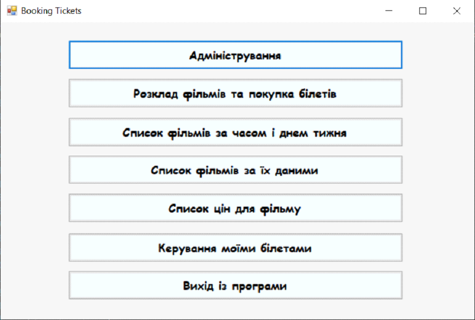  
  

  
Рисунок 2.5.1 - Ескіз головного вікна  
Для налаштування таблиць - додавання нових записів чи зміни існуючих чи видалення поточних рядків таблиці, що може роботи лише адміністратор, потрібно пройти авторизацію для адміністратора, натиснувши на першу кнопку. Коли натиснути на кнопку “Адміністрування”, відкривається вікно з входом у додаток для адміністратора:  
  
  
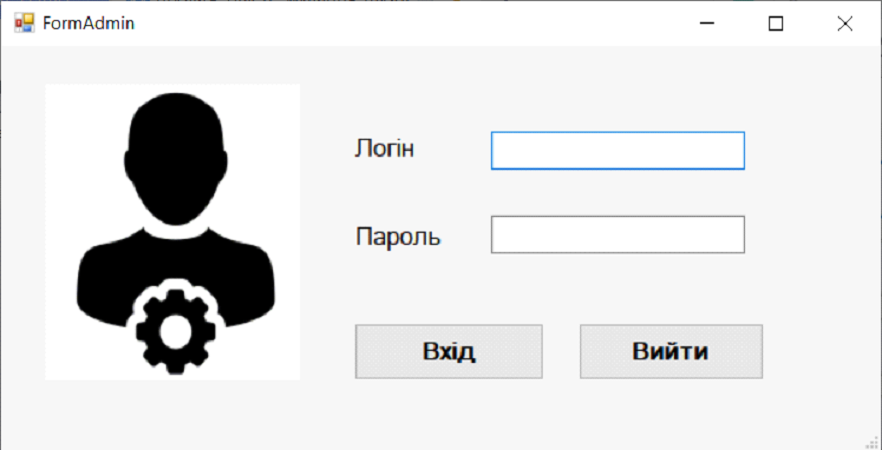    
     
Рисунок 2.5.2 - Ескіз вікна авторизації для адміністратора  

Адміністратор, пройшовши автентифікацію, тобто ввіши правильний логін та пароль (у файлах ресурсів проекту resx налаштовано логін: admin та пароль: admin) і натиснувши кнопку “Вхід”, адміністратор потрапляє у форму для адміністрування таблицями бази даних. (Авторизація у даному додатку виконана в цілях безпеки, щоб не кожний користувач зміг вносити зміни до бази).
Відкривається форма для адміністратора  зі вкладками на кожну таблицю у базі:
  
  
  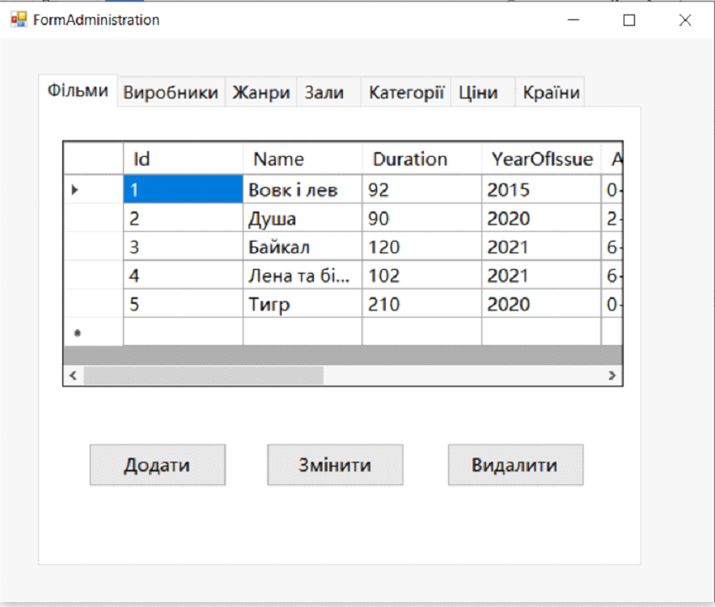   

    
Рисунок 2.5.3 - форма адміністрування (вкладка фільми)  
  
  
  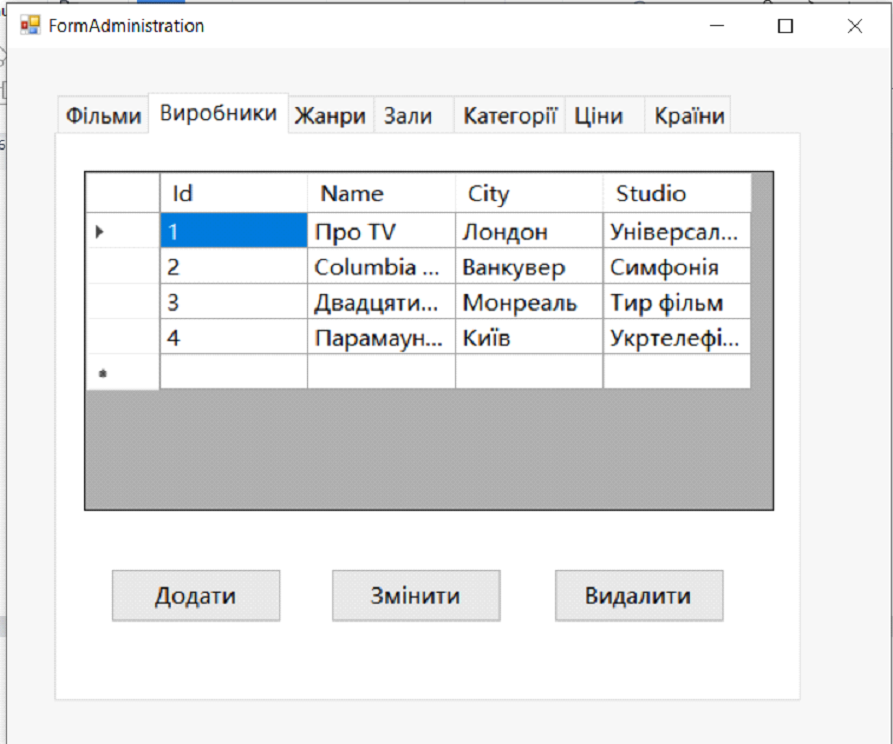
  
Рисунок 2.5.4 - форма адміністрування (вкладка виробники)  

   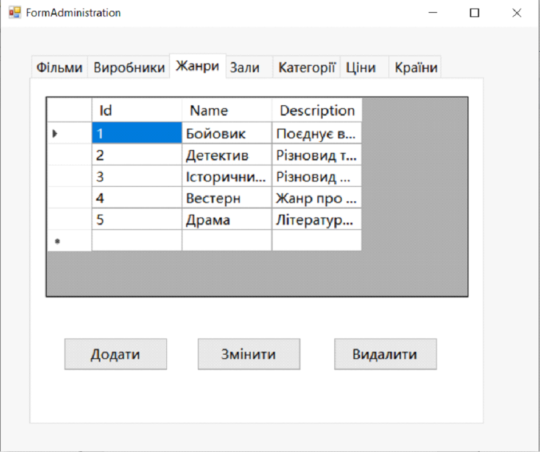  

 
Рисунок 2.5.5 - форма адміністрування (вкладка жанри)  

   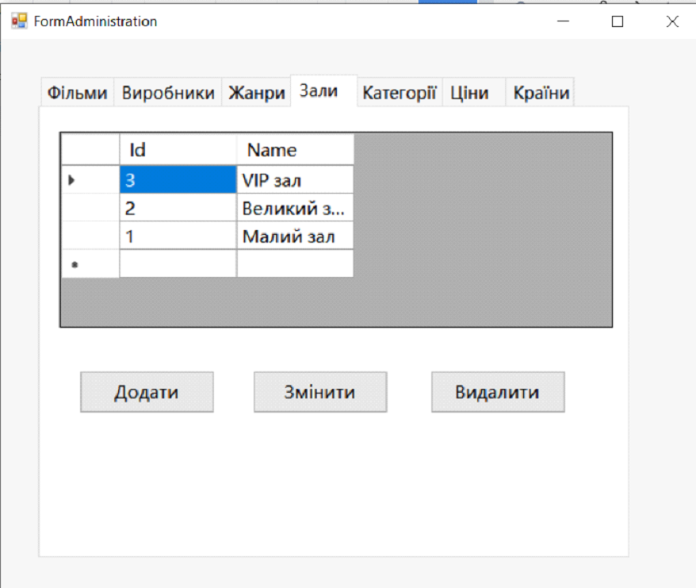  

   
Рисунок 2.5.6 - форма адміністрування (вкладка зали)  

  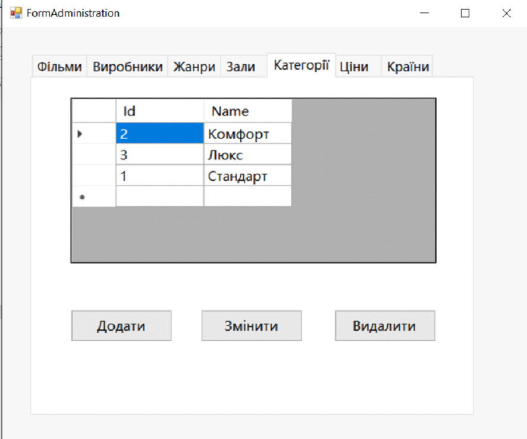  
  
   
Рисунок 2.5.7 - форма адміністрування (вкладка категорії)

  
  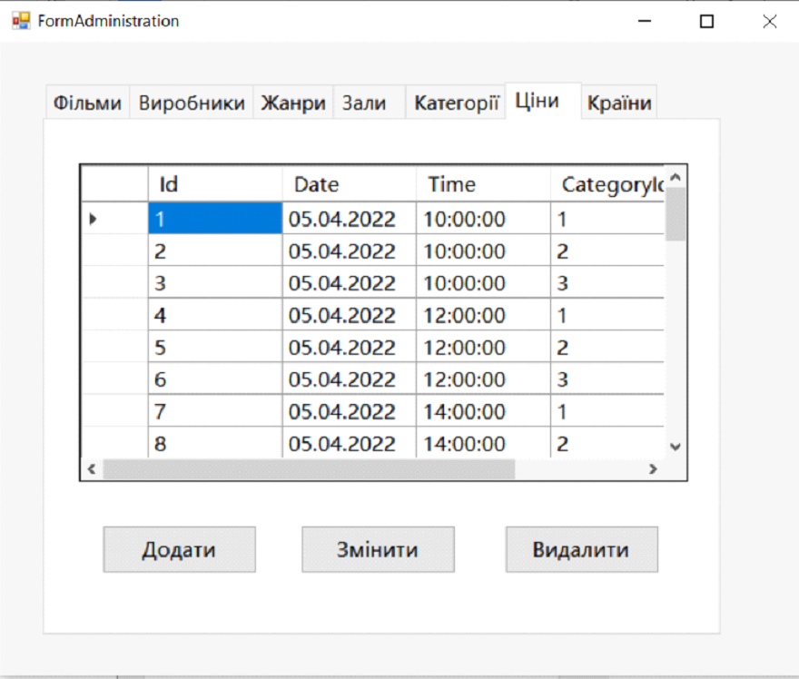  

   
Рисунок 2.5.8 - форма адміністрування (вкладка ціни)  
  

  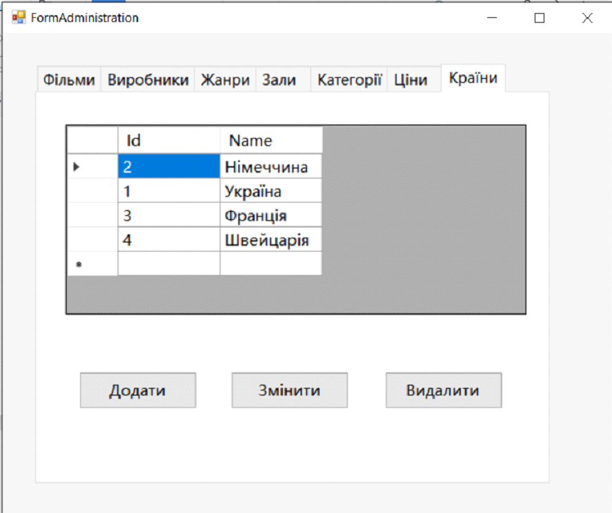    

    
   
Рисунок 2.5.9 - форма адміністрування (вкладка країни)  

  

На кожній формі є можливість додати новий рядок, змінити чи видалити поточний(-і) рядок(-ки). Для прикладу, додамо нові дані для таблиці фільми (при цьому відкривається нова форма зі всіма полями, що необхідно ввести):  
  
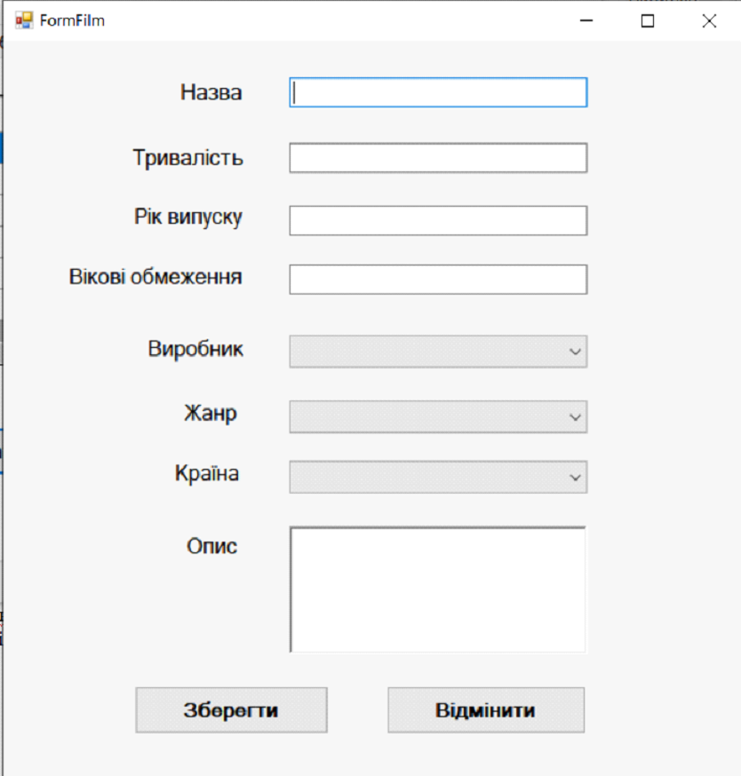    
  
   
Рисунок 2.5.4 - форма для додавання нового фільму  
  
При цьому для зовнішніх ключів використані спеціальні елементи comboBox, в які динамічно підгружаються (за допомогою методу load для форми) дані з інших таблиць. Для прикладу для comboBoxProduction підгружаються дані всіх назв виробників, що є у базі:  
  
  
   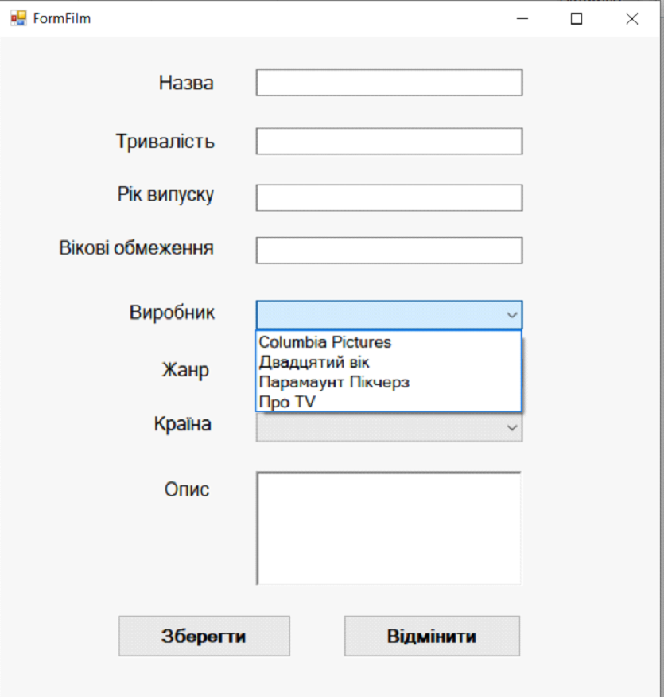    
    
Рисунок 2.5.5 - форма для додавання нового фільму   
  
Аналогічно працюють comboBox-и і для жанру та країн. При введенні всіх даних та натиску кнопки “Додати” адміністратором буде додано новий фільм у базу даних. Для зміни вже існуючих рядків у базі даних, необхідно натиснути на кнопку “Змінити”, відкриється та ж форма, що і для додавання рядків, але вона буде містити одразу заповнені всі поля. Та при необхідності їх можна буде змінити адміністратору та зберегти зміни:  
  
  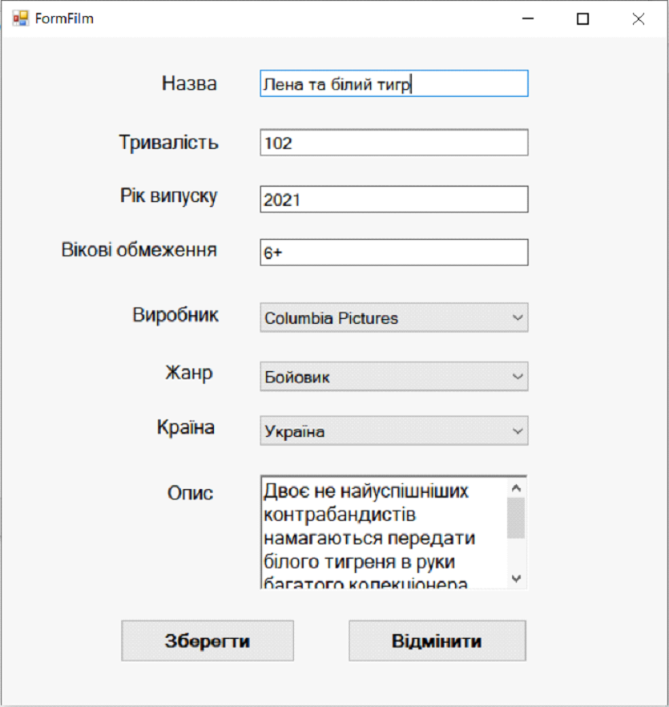  

  
Рисунок 2.5.6 - форма для зміни фільму  

  
Для того, щоб видалити вже існуючі у базі фільми, можна виділити рядок або комірки фільмів, що адміністратору необхідно видалити та натиснути на кнопку “Видалити”. Оброблювач кнопки видалити налаштований таким чином, що можна видалити одразу декілька рядків або лише один, при цьому можна виділити або комірки або рядки, обровлювачі налаштовані на різні  можливі події.
Аналогічно працюють і інші форми. Ще для прикладу наведемо форму Ціна. Для роботи із датою і часом використовувались спеціальні елементи dateTimePicker. Для того, щоб додати новий запис у таблицю буде виведена така форма:  

  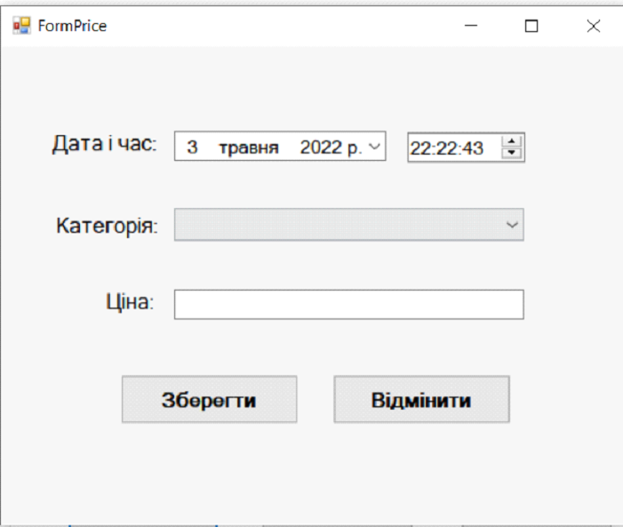  
 
Рисунок 2.5.7 - Форма для додавання ціни  
  
  
Також при зміні вже існуючого рядка, натискаємо на кнопку “Змінити” та будуть виведені дані у всіх полях та буде змога їх змінити:  

  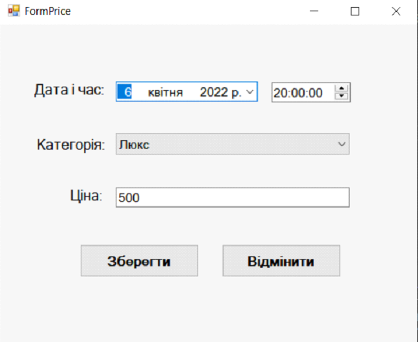  
    
Рисунок 2.5.8 - Форма для зміни ціни  

  
Для прикладу видалення із бази даних, виділимо декілька рядків у вкладці Ціна та натиснемо кнопку “Видалити”:  
  
  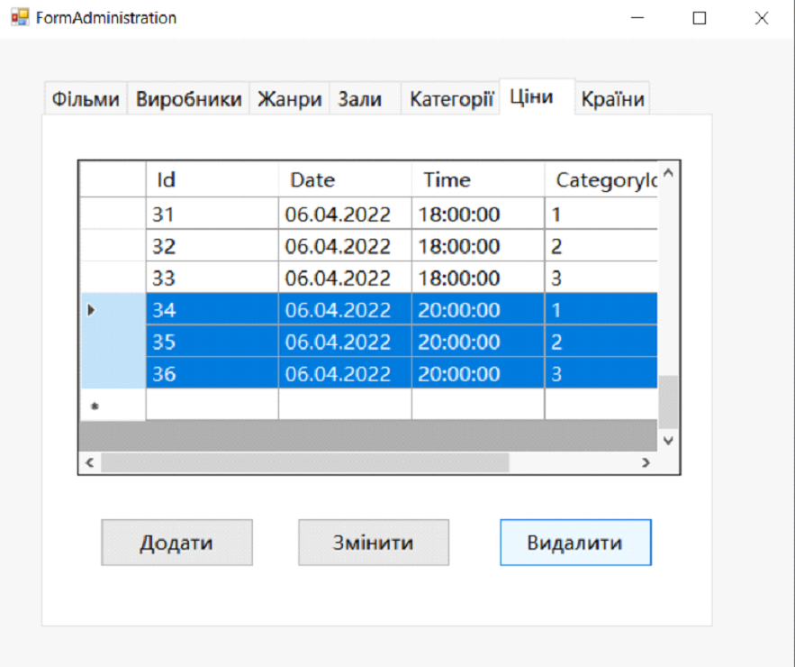 
   
Рисунок 2.5.9 - Виділення декількох рядків для вкладки Ціна  
  
  
Після натиску на кнопку “Видалити”, три рядки видаляються із бази даних, та зберігаються зміни у базі даних. І відповідно, написаний код для оновлення елемента dataGridView також спрацьовує одразу і можна побачити оновлену таблицю:  

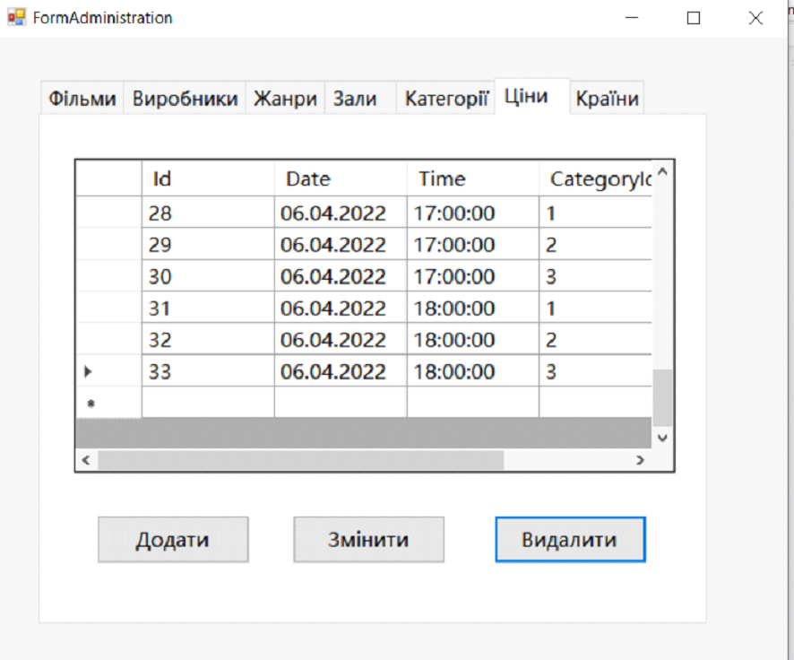    
  
 
Рисунок 2.5.10 - Вкладка Ціна після видалення   

   
Всі інші вкладки працюють аналогічно. Якщо у головному меню обрати кнопку “Розклад фільмів та покупка білетів”, буде відкриватись такий графічний інтерфейс:

  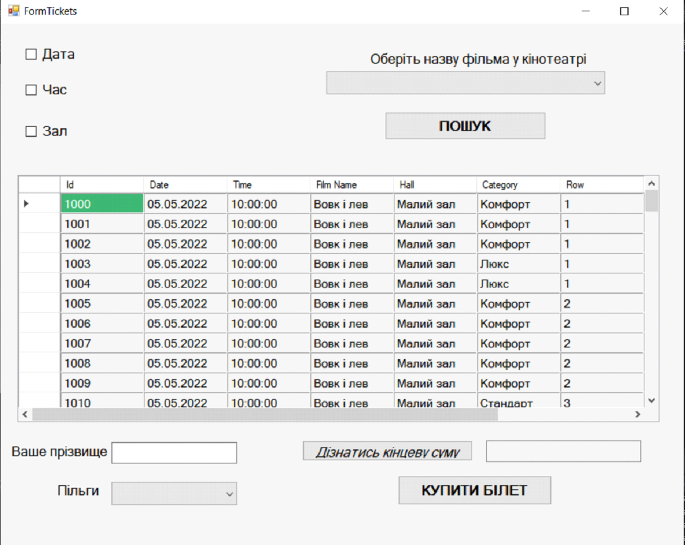  

   
Рисунок 2.5.11 - Форма FormTickets  

  
Для того, щоб додати фільтри, можна натиснути на спеціальний елемент checkBox для трьох фільтрів - дата, час та зал, та ввести дані. А також вибрати назву фільму у елементі comboBox. Для прикладу, введемо певні дані для пошуку і натиснемо кнопку “Пошук”:  

  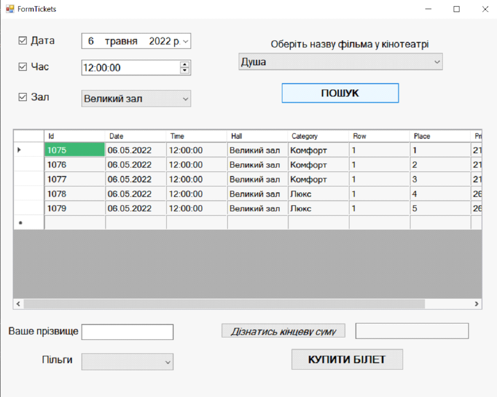  

   
Рисунок 2.5.12 - Форма FormTickets (пошук вільних білетів за критеріями)  
  

  
Після того, як користувач знайде по своїх критеріях часу, дати, зали та фільму, він може купити білет, ввівши своє прізвище та пільги, якщо вони у нього є, а також є кнопка “Дізнатись кінцеву суму”, яка буде вираховувати суму, після пільгів.   
  
Якщо на головній формі користувач натисне кнопку “Список фільмів за часом і днем тижня”, то відкриється форма, на якій він зможе знайти фільми за критеріями часу та дня тидня: понеділок, вівторок, четвер, середа, пятниця, субота чи неділя (дні тижня в коді записані у елемент comboBox). Здійснимо одразу пошук за певними критеріями:  
  

   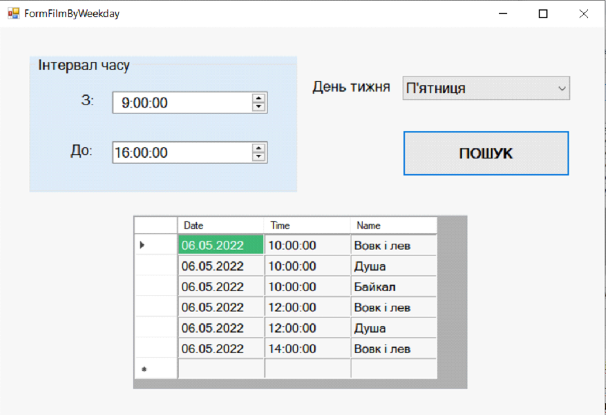  

      
Рисунок 2.5.13 - Форма FormFilmByWeekday  

     
Якщо на головній формі користувач натисне кнопку “Список фільмів за їх даними”, то він зможе ввести жанр, виробництво та назву фільму і знайти відповідні фільми. При цьому, у даній формі, як тільки користувач почне введення, буде одразу ж здійснюватись пошук по базі даних. А також вкінці буде виведена загальна кількість знайдених фільмів по критеріях їх даних. Форма:  

   
   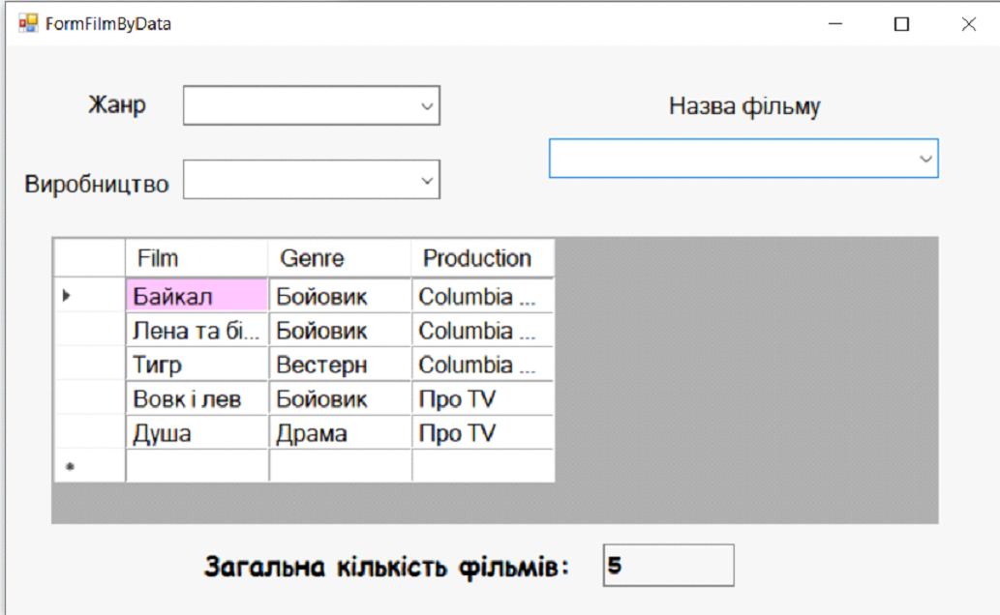
 
Рисунок 2.5.14 - Форма FormFilmByData  

    
Якщо на головній формі користувач натисне кнопку “Список цін для фільму”, то він зможе побачити ціну для обраного фільму у вже відсортованому вигляді у зростанні цін, а також здійснити власне сортування за необхідності за будь-якими критеріями, натиснувши при цьому на стовпець. Форма:  
  
  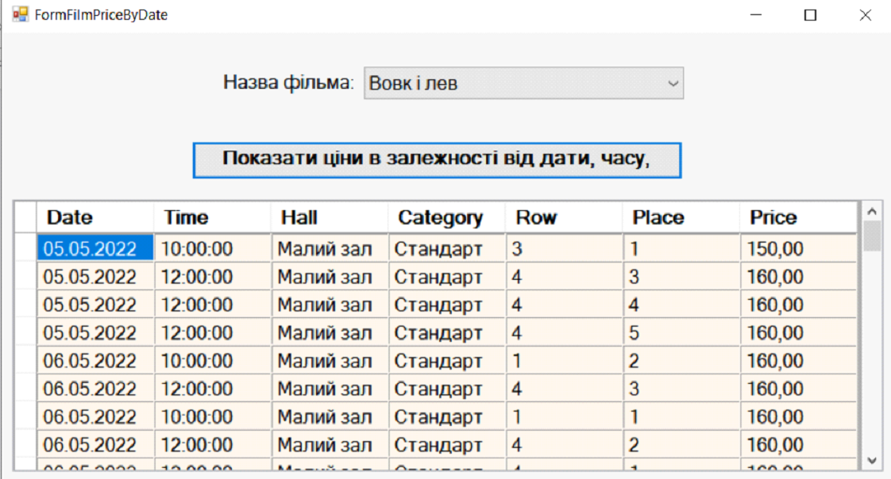  
  
Рисунок 2.5.15 - Форма FormFilmPriceByDate  

  
Якщо користувач натисне кнопку “Керування моїми білетами”, то користувач він зможе побачити свій квиток, якщо введе своє прізвище та номер білету:  

  
  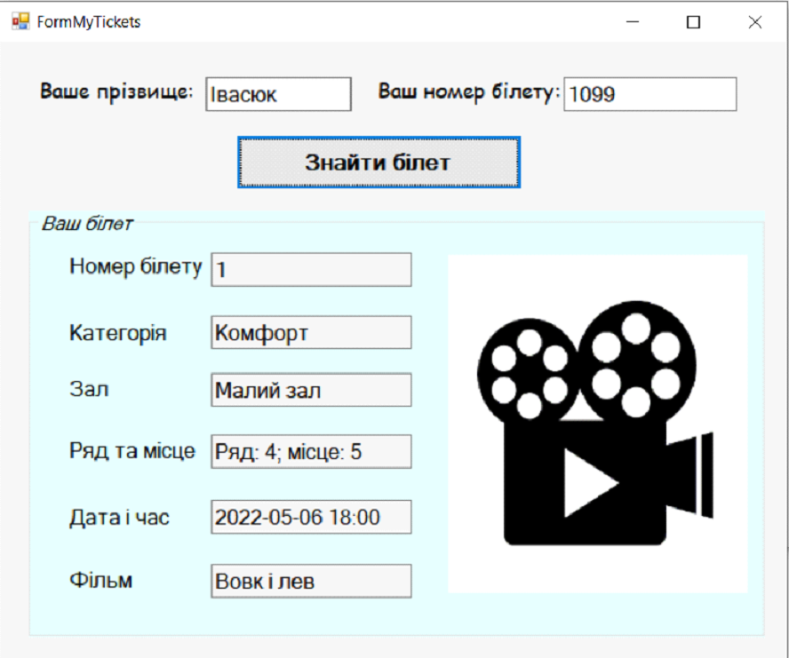  
  

    
Рисунок 2.5.16 - Форма FormMyTickets  
  
 
Якщо користувач натисне на головній формі кнопку “Вихід із програми”, то, відповідно, програма завершить свою роботу.  


  
4.6  

  
База даних “Покупка білетів” створена в СУБД MySql. База даних використовується для зберігання даних про фільми, білети, виробників, країни, жанри, зали, покупки, категорії, ціни.
  BookingTickets  

Таблиця Країни зберігає інформацію про країни, у яких були зняті фільми.   
   Country
  
Таблиця Виробники зберігає інформацію про виробників, які знімали фільм -їхню назву, місто, де вони знаходяться та студія.   
 Production
  
Таблиця жанри зберігає інформацію про жанри фільмів - їхню назву та опис  
  Genre
 
Таблиця зали зберігає інформацію про зали кінотеатру.  
 Hall
  

Таблиця категорія зберігає інформацію про категорії кінотеатру.  
 Category
 
Таблиця ціни зберігає інформацію про ціни у кінотеатрі, в залежності від дати ,часу, категорії.   
  Price
 
Таблиця фільми зберігає інформацію про сам фільм - його назву, тривалість, рік виходу фільму, вікових обмежень, виробника, жанру, країни, опис.  
  Film
 
Таблиця покупка відповідає за покупку білетів - дату, час, зал, ряд, місце, фільм, ціну, та булеву змінну яка відповідає за те, чи проданий квиток.   
Booking

Таблиця білет відповідає за куплені білети - дата, час, зал, ряд, покупець, пільги, номер білету, ціна 
  Ticket

Також були написані користувацькі процедури для виконання додатку. Код деяких процедур:
Процедура для пошуку ще не проданих квитків (з виведенням певних стовпців):   
 sp_BookingInfo()

Процедура для пошуку ще не проданих квитків (з виведенням певних стовпців) за критеріями: назва фільму, дата, час: 
 sp_BookingInfoByNameDateTime  
  
Процедура для пошуку цін  (з виведенням певних стовпців) в залежності від назви фільму, вивід посортований за зростанням цін:  
  sp_PricesByRequirements



  

Висновки  
В наші дні на ринку представлена безліч технологій доступу до даних і серверів баз даних, кожне, з яких має свої відмінні риси. Сучасні додатки обробки даних орієнтовані на роботу з великою кількістю користувачів, на їх віддаленість від місця того, що має в розпорядженні основного сервера БД.  
Програмне забезпечення роботи кінотеатру істотно спрощує роботу співробітників, а також надає можливість отримання необхідної інформації відвідувачам про сеанси і кінофільми, вартість квитків.  
 Розроблюваний програмний продукт дозволить автоматизувати роботу каси кінотеатру.  
В результаті виконання дипломної роботи були вдосконалені знання в області програмування баз даних MySql, технології ADO.NET, мові програмування C# та додатку Windows Forms.    
  
  
  
    
  
  
